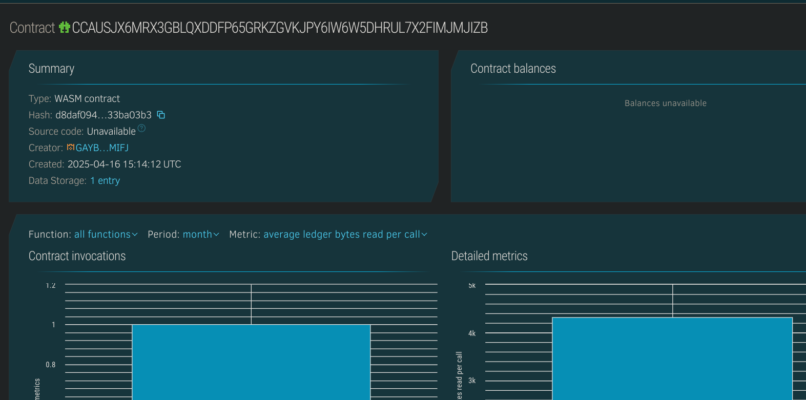

# P2P Marketplace

## Project Title
P2P Marketplace

## Project Description
A decentralized Peer-to-Peer (P2P) marketplace where users can create listings, view products, and perform buy/sell transactions. This contract allows product listings to be created with a price, description, and status, and it provides the ability for buyers to mark products as sold.

## Project Vision
This P2P marketplace aims to provide a secure, transparent, and decentralized platform for users to trade products. By utilizing blockchain technology, it removes intermediaries and gives users full control over their transactions.

## Key Features
- **Create Listings**: Users can create product listings with a title, description, price, and seller information.
- **Buy Products**: Buyers can purchase products directly, marking them as sold on the blockchain.
- **View Listings**: Users can browse and view all available product listings.
- **Sold Status**: Once a product is bought, it is marked as sold and removed from further purchases.

## Future Scope
- **Payment Integration**: Integrating cryptocurrency payments directly within the contract.
- **Ratings and Reviews**: Allowing users to rate and leave reviews for sellers and products.
- **Escrow Mechanism**: Implementing an escrow system for increased trust between buyers and sellers.
- **User Profile**: Creating a system for user profiles with transaction history.

## Contract Details
CCAUSJX6MRX3GBLQXDDFP65GRKZGVKJPY6IW6W5DHRUL7X2FIMJMJIZB
